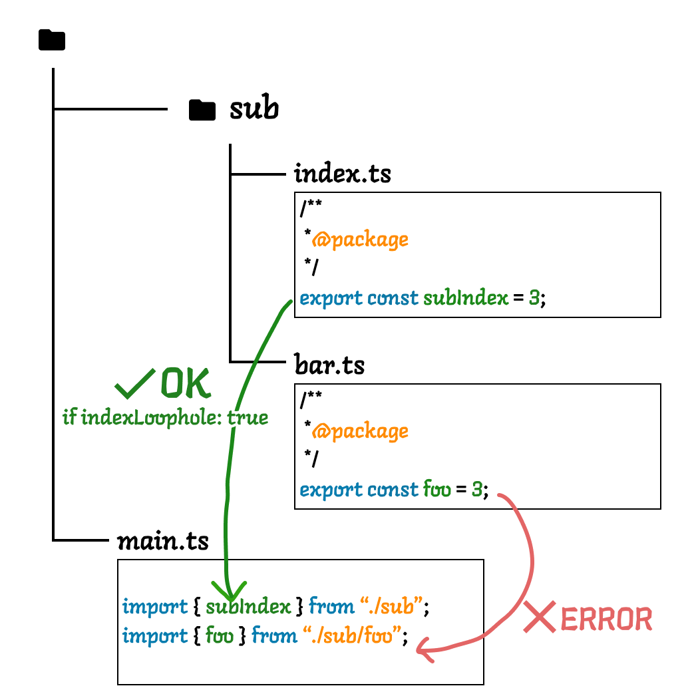
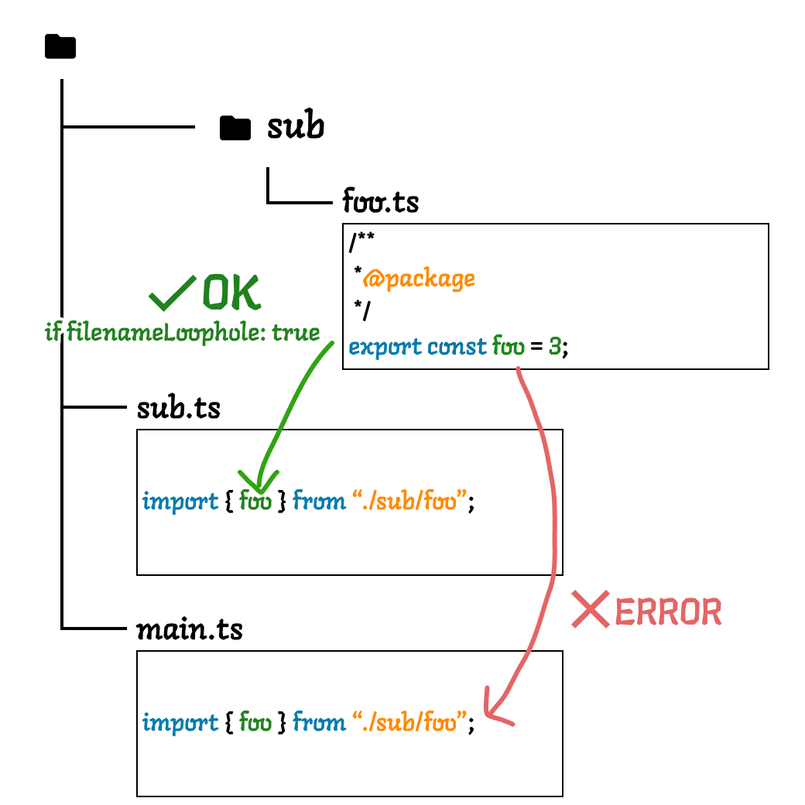

# `import-access/jsdoc` rule

_Note: although this rule does not seem related to types, this rule requires [typescript-eslint](https://github.com/typescript-eslint/typescript-eslint) settings with [the `project` parser option set](https://typescript-eslint.io/packages/parser/#project)._

When this rule is enabled, `export` declaration can have a JSDoc `@package` annotation. Such exports can be imported only from files in the same directory or sub directories in that directory.

As a bonus feature, importing exports annotated with `@private` is always forbidden.

**Example settings in .eslintrc.js**:

```js
  "rules": {
    "import-access/jsdoc": ["error", {
      "indexLoophole": true,
      "filenameLoophole": false,
      "defaultImportability": "public", // "public" | "package" | "private"
      "treatSelfReferenceAs": "external", // "internal" | "external"
      "excludeSourcePatterns": ["generated/**/*"] // Array of glob patterns for source paths to exclude
    }],
  }
```

## Example

```ts
// ----- sub/foo.ts -----

/**
 * @package
 */
export const fooPackageVariable = "I am package-private export";

// ----- sub/bar.ts -----
// This is correct because foo.ts is in the same directory
import { fooPackageVariable } from "./foo";

// ----- baz.ts -----
// This is INCORRECT because package-private exports
// cannot be imported from outside the sub directory
import { fooPackageVariable } from "./sub/foo";
```

## Options

The `import-access/jsdoc` rule has the following options. All options are optional (see below for default values).

```ts
type JSDocRuleOptions = {
  indexLoophole: boolean;
  filenameLoophole: boolean;
  defaultImportability: "public" | "package" | "private";
  treatSelfReferenceAs: "internal" | "external";
  excludeSourcePatterns?: string[];
};
```

### `indexLoophole`

_Default value: `true`_

Enables the **index loophole** feature. When this option is enabled, `sub/index.ts` is treated similarly to `sub.ts`. That is, package-private exports exported from `index.ts` can be imported from files in the parent directory.



**Example:**

```ts
// ----- sub/index.ts
/**
 * @package
 */
export const subIndex = 3;

// ----- sub/foo.ts
/**
 * @package
 */
export const foo = 3;

// ----- main.ts
// This is CORRECT under indexLoophole: true
import { subIndex } from "./sub";
// This is still INCORRECT
import { foo } from "./sub/foo";
```

Note that the loophole is effective only for one level. That is, package-private exports from `index.ts` cannot be imported from files in the parent directory's parent directory.

```ts
// ----- sub/sub2/index.ts

/**
 * @package
 */
export const pika = "chu";

// ----- sub/foo.ts
// This is correct
import { pika } from "./sub2/index";

// ----- bar.ts
// This is still INCORRECT
import { pika } from "./sub/sub2/index`;
```

### `filenameLoophole`

_Default value: `false`_

Enables the **filename loophole** feature. When this option is enabled, package-private exports in a directory can be imported from a file with the same name as the directory.



**Example:**

```ts
// ----- sub/foo.ts

/**
 * @package
 */
export const pika = "chu";

// ----- sub.ts
// This is correct to import a package-private exports
// from the directory named `sub`
import { pika } from "./sub/foo";

// ----- pika.ts
// This is still INCORRECT because file name does not match
// the directory name
import { pika } from "./sub/foo";
```

### `defaultImportability`

_Default value: `public`_

You can set default importability value that applies to the entire project.

For example, if you set the default importability to `package`, any export without JSDoc annotation is treated as `@package`.

You can override this default value by adding JSDoc annotation to the export. To make an export public, add `@public` annotation.

**Example:**

```ts
// defaultImportability: "package"
// ----- sub/bar.ts

export const pika = "chu"; // no JSDoc, but automatically applied @package

// ----- sub/foo.ts
// you can import
import { pika } from "./bar";

// ----- bar2.ts
// you cannot import because pika is @package
import { pika } from "./sub/bar`;
```

### `treatSelfReferenceAs`

_Default value: `external`_

Self referencing is [a feature of Node.js](https://nodejs.org/api/packages.html#self-referencing-a-package-using-its-name) that allows importing a file in the same package by using package name as the module specifier.

When this option is set to `external`, self reference is treated as an external export. Therefore, no restriction is applied to such imports.

When this option is set to `internal`, self reference is treated as an internal export. Therefore, self reference is restricted by the same rules as other internal exports.

**Example:**

```ts
// ----- src/somewhere/foo.ts
/**
 * @package
 */
export const something = "something";

// ----- src/main.ts
// This is CORRECT when treatSelfReferenceAs: external
import { something } from "my-package/foo";
```

In the above example, `my-package/foo` is a self reference that connects to `src/somewhere/foo.ts`.

When `treatSelfReferenceAs: external`, this import is always allowed even though `something` is a package-private export because it is treated like an import from an external package.

When `treatSelfReferenceAs: internal`, this import is disallowed because import from `my-package/foo` is treated like an import from `src/somewhere/foo.ts`.

### `excludeSourcePatterns`

_Default value: `[]`_

An array of glob patterns for source paths to exclude from the importability check. The patterns are resolved relative to the project root. When importing from a module that matches one of these patterns, the import-access/jsdoc rule will not apply any restrictions, regardless of the JSDoc annotations or defaultImportability setting.

This is particularly useful for handling imports from auto-generated files that don't have proper JSDoc annotations.

The patterns use the [minimatch](https://github.com/isaacs/minimatch) library's glob syntax.

**Examples:**

```ts
// Example: Match by file path
// excludeSourcePatterns: ["src/types/**/*.d.ts"]
import { typeDefinition } from "../types/api"; // Allowed if the implementation is in a .d.ts file in the src/types directory
```

Additional examples:
```js
// Match all files in a particular directory
"src/generated/**"

// Match multiple extensions
"**/*.{generated,auto}.{ts,js}"

// Match files with specific naming patterns
"**/[a-z]*.auto.ts"

// Match specific type definition files
"src/**/*.d.ts"
```


**Next.js specific configuration:**

When working with Next.js projects, it's recommended to exclude the `.next` directory which contains auto-generated files:

```js
// In your .eslintrc.js
{
  "rules": {
    "import-access/jsdoc": ["error", {
      // ... other options ...
      "excludeSourcePatterns": [".next/**"]
    }]
  }
}
```

This will ensure that any imports from auto-generated files in the `.next` directory are not subject to import-access restrictions.

